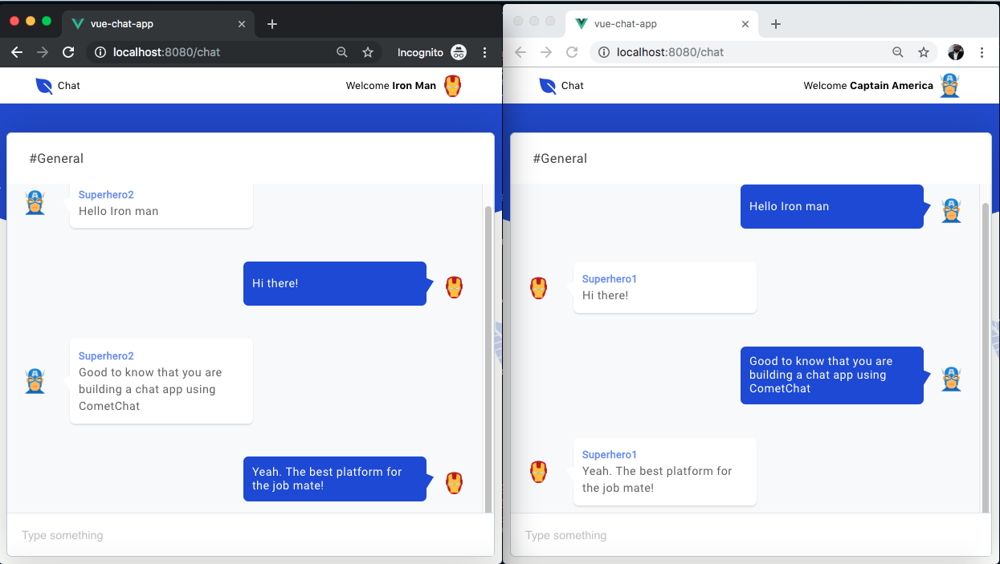

# Build a jQuery chat app

Read the full tutorial here:

>> Not yet published

This application detailed the step by step guide on how to build a modern group chat application using jQuery and CometChat.

Take a look at the screenshot below:




## Technology

This demo uses:
* [CometChat](https://cometchat.com/)
* [jQuery](https://jquery.com/)


## Running the demo
To run the demo follow these steps:

1. Head to the [CometChat dashboard](https://app.cometchat.com/) (you'll need to create a free account if you haven't already)
2. From the dashboard, create a new app called "vue-group-chat"
3. Once created, click the button **Explore**
4. Click **API Keys** on the left-hand-side and note the automatically-generated Full access API Key and the application ID as well
5. Go to the **Groups** tab and note the GUID of the group automatically created by CometChat
6. Download the repository [here](https://github.com/cometchat-pro-tutorials/jquery-chat-app/archive/master.zip) or by running `git clone https://github.com/cometchat-pro-tutorials/jquery-chat-app.git`

7. Uncomment the following script located within the `./index.html` file:

```
<script src="js/chatServiceUpdated.js"></script>
<script src="js/scripts.js"></script>
```


8. Open the script located in `./js/chatServiceUpdated.js` within the project. Then, locate the placeholder below and replace it with the appropriate credentials as obtained from your CometChat dashboard.

```
YOUR_COMET_CHAT_APP_ID
YOUR_COMET_CHAT_API_KEY
```

9. Open the `./index.html` file in your favorite browser to run the application